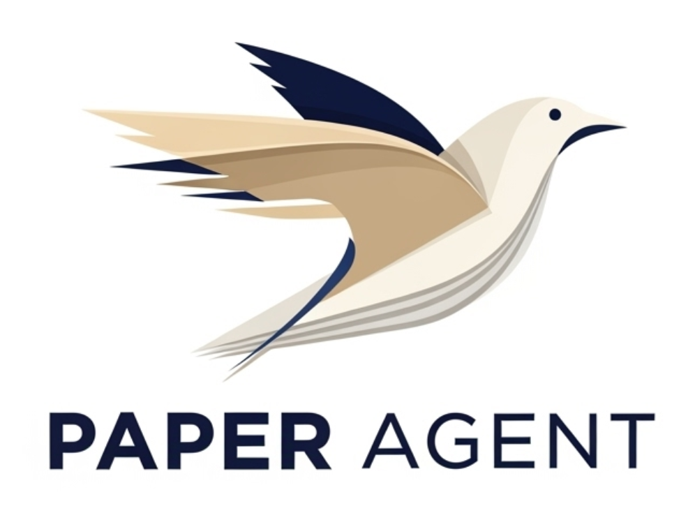

<p align="center">
  
</p>
<h1 align="center">Paper Agent - Zotero Arxiv Daily </h1>

<p align="center">
  
  
  
</p>

<p align="center">
  Your personal AI research assistant that serves you a daily dose of arXiv papers, tailored to your interests from Zotero or the pdfs from your local folder.
</p>

---

## ✨ Features

- **Dual Preference Sources**: Build your interest profile based on your Zotero library OR a local directory of PDF files.
- **Personalized Paper Recommendations**: Leverages your chosen preference source to understand your research interests.
- **Daily arXiv Digest**: Fetches the latest papers from your favorite arXiv categories.
- **AI-Powered Summaries**: Uses a Large Language Model (LLM) to generate concise summaries of each paper.
- **Multi-language Support**: Get summaries in your preferred language (English or Chinese supported out-of-the-box).
- **Highly Configurable**: Easily tune the agent's behavior through a simple `config.yaml` file.

## 🚀 Getting Started

### 📋 Prerequisites

- Python 3.11+
- A Zotero account (if using the Zotero preference source) or from your local directory of PDF files.
- An OpenAI-compatible API key for paper summarization

### ⚙️ Installation

1.  **Clone the repository:**
    ```bash
    git clone https://github.com/Marverlises/Paper-Agent-Zotero.git
    cd Paper-Agent-Zotero
    ```

2.  **Play with:**
    ```bash
    uv run main.py
    ```

### 🛠️ Configuration

1.  If it doesn't exist, create a `src/config.yaml` file. You can use the following as a template:

2.  Open `src/config.yaml` and configure the following:

    - **`preference_source`**: Set this to `"zotero"` or `"local"` to define your source of interest papers.

    - **`zotero`** (if `preference_source: "zotero"`):
        - `id`: Your Zotero user ID.
        - `key`: Your Zotero API key.
        - `recency_months`: How recent the papers from your Zotero library should be to be considered for interest calculation.

    - **`local`** (if `preference_source: "local"`):
        - `path`: The file path to your local directory of preferred papers in this folder.

    - **`arxiv`**:
        - `query`: The arXiv categories you want to follow (e.g., `cs.AI+cs.CV`).
    - **`llm`**:
        - `openai_api_key`: Your OpenAI-compatible API key.
        - `openai_api_base`: The base URL for your LLM API.
        - `model_name`: The model you want to use for summarization (e.g., `gpt-4o`).

    For more details, see the comments in the `config.yaml` file.

## 🏃‍♀️ Usage

To run the agent and generate your daily paper digest, simply run:

```bash
uv run main.py
```

The daily digest will be saved as a Markdown file in the `year-month-day-hour` directory.


## 🤝 Contributing

Contributions are welcome! Please feel free to submit a pull request or open an issue.

## 📄 License
Please see the `LICENSE` file for details.

