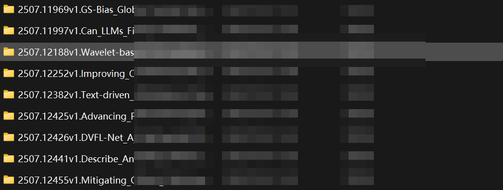
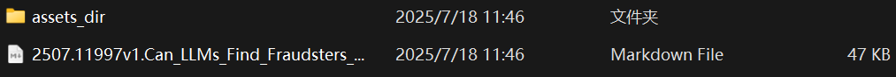
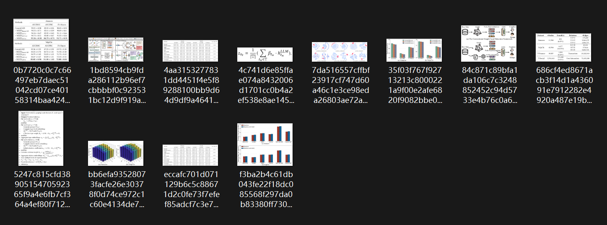
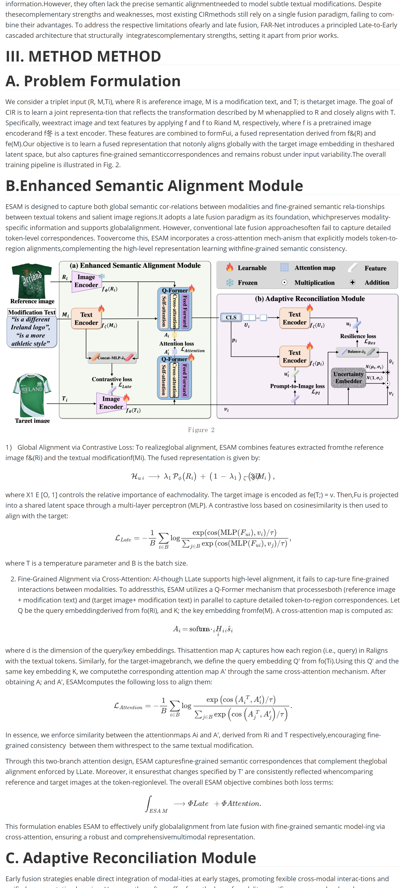

<p align="center">
  
</p>
<h1 align="center">Paper Agent - Zotero Arxiv Daily</h1>

<p align="center">
  <a href="README_en.md">English</a> | 中文
</p>

<p align="center">
  
  
  
</p>

<p align="center">
  您的个人AI研究助理，根据您的Zotero收藏或本地PDF文件夹的兴趣，为您提供每日arXiv论文。
</p>

---

## ✨ 功能

- **双重偏好来源**：根据您的Zotero库或本地PDF文件目录构建您的兴趣画像。
- **个性化论文推荐**：利用您选择的偏好来源来了解您的研究兴趣。
- **每日arXiv摘要**：从您最喜欢的arXiv类别中获取最新的论文。
- **AI驱动的摘要**：使用大型语言模型（LLM）生成每篇论文的简洁摘要。
- **多语言支持**：获取您首选语言的摘要（默认支持英语或中文）。
- **高度可配置**：通过一个简单的`config.yaml`文件轻松调整代理的行为。

## 🚀 开始

### 📋 先决条件

- Python 3.11+
- 一个Zotero帐户（如果使用Zotero作为偏好来源）或您的本地PDF文件目录。
- 用于论文摘要的OpenAI兼容API密钥。

### ⚙️ 安装

1.  **克隆仓库：**
    ```bash
    git clone https://github.com/Marverlises/Paper-Agent-Zotero.git
    cd Paper-Agent-Zotero
    ```

2.  **运行：**
    ```bash
    uv run main.py
    ```

### 🛠️ 配置

1.  如果不存在，请创建一个`src/config.yaml`文件。您可以使用以下内容作为模板：

2.  打开`src/config.yaml`并配置以下内容：

    - **`preference_source`**：将其设置为`"zotero"`或`"local"`以定义您的兴趣论文来源。

    - **`zotero`**（如果`preference_source: "zotero"`）：
        - `id`：您的Zotero用户ID。
        - `key`：您的Zotero API密钥。
        - `recency_months`：您的Zotero库中的论文应考虑多新以用于兴趣计算。

    - **`local`**（如果`preference_source: "local"`）：
        - `path`：此文件夹中您首选论文的本地目录的文件路径。

    - **`arxiv`**：
        - `query`：您想要关注的arXiv类别（例如，`cs.AI+cs.CV`）。
    - **`llm`**：
        - `openai_api_key`：您的OpenAI兼容API密钥。
        - `openai_api_base`：您的LLM API的基础URL。
        - `model_name`：您想要用于摘要的模型（例如，`gpt-4o`）。

    有关更多详细信息，请参阅`config.yaml`文件中的注释。

## 🏃‍♀️ 使用

要运行代理并生成您的每日论文摘要，只需运行：

```bash
uv run main.py
```

每日摘要将作为Markdown文件保存在`年-月-日-小时`目录中。

## 👓示例输出

- 示例输出文件夹树

```
[YYYY-MM-DD-HH]/ 
│   └── (示例输出)
├── Daily_Report.md
│   └── (Top-N最相关论文的快速浏览)
├── assets_dir/
│   └── (每篇论文的详细报告，附带图片)
├── [arXiv_ID]v[version].[Paper_Title].pdf
├── [arXiv_ID]v[version].[Paper_Title].pdf
└── ...
```

- `assets_dir`中的详细信息



在每个文件夹中，结果如下：



在每篇论文的`assets_dir`中：



在每篇论文的详细信息markdown文件中（部分结果）：



## 🤝 贡献

欢迎贡献！请随时提交拉取请求或开启一个问题。

## 📄 许可证
有关详细信息，请参阅`LICENSE`文件。 